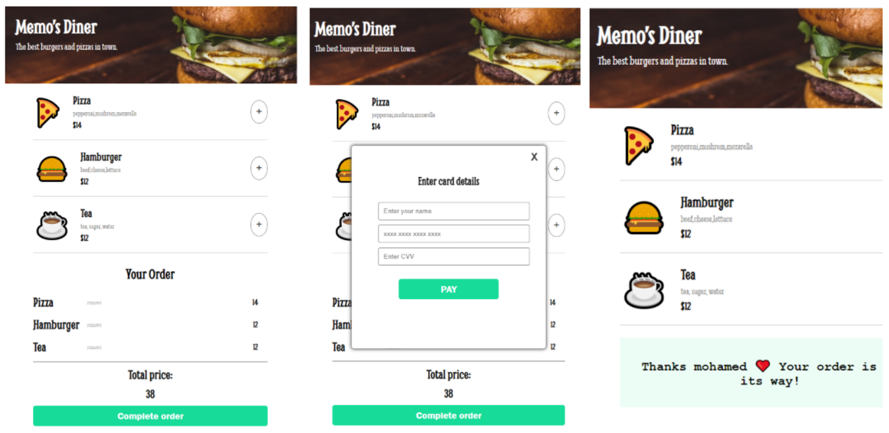

## Table of contents

- [Overview](#overview)
  - [The challenge](#the-challenge)
  - [Screenshot](#screenshot)
  - [Links](#links)
  - [How to install](#how-to-install)
- [My process](#my-process)
  - [Requirments](#Requirments)

## Overview

### The challenge

Restaurant Ordering app

### Screenshot

### Links

- Solution URL: [GitHub](https://github.com/memo-ibrahim-alean/Restaurant-Ordering-app)
- Live Site URL: [Live](https://memo-ibrahim-alean.github.io/Restaurant-Ordering-app/)

### How to install

- Clone Repo or Download Zip
- That's it! 🎉

## My process

### Requirments

- Render the menu options using JS
- Be able to add/remove items
- Have a payment modal with compulsory form inputs 
